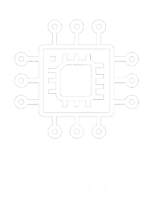

<<<<<<< HEAD
# partix

A new Flutter project.

## Getting Started

This project is a starting point for a Flutter application.

A few resources to get you started if this is your first Flutter project:

- [Lab: Write your first Flutter app](https://docs.flutter.dev/get-started/codelab)
- [Cookbook: Useful Flutter samples](https://docs.flutter.dev/cookbook)

For help getting started with Flutter development, view the
[online documentation](https://docs.flutter.dev/), which offers tutorials,
samples, guidance on mobile development, and a full API reference.
=======
# 💻 Partix — PC Parts Marketplace
             
  

- Partix: Your ultimate marketplace for PC components. Find processors, graphics cards, motherboards, RAM, storage, monitors, and more for your dream build.

# 🏗️ Tech Stack

- 📱 Frontend: Flutter, Dart
- 📑 State Management: Bloc (for robust and predictable state management)
- </> Backend: Supabase (utilized for secure user authentication and persistent data storage, powering features like product listings, user profiles, wishlists, and order history)
- 🧼 Architecture: Clean Architecture (for scalable, maintainable, and testable code)
- 🎨 Design: Figma

# 🎨 Figma Design
  Check out the complete design of the Partix app on Figma:
[Partix App Figma](https://www.figma.com/design/eudOjOAZksllis3Jb5I7vn/Untitled?node-id=0-1&t=4CnYmJ0VJGORIfR4-1)

# 📦 External Packages
Partix leverages several powerful external packages to enhance user experience and streamline development:
- bloc: A core package for implementing the Bloc state management pattern.
- shared_preferences: Used for lightweight and persistent key-value storage on the device.

# 💡 How to Use
Partix makes finding and purchasing PC parts simple and enjoyable.

- ✍🏽 Login / Sign Up:
Start by creating a new account or logging in with your email and password to access all features.

- 👀 Browse Components:
Explore a diverse range of PC components categorized for easy navigation, including CPUs, GPUs, RAM, storage, monitors, and more.

- ❤️ Add to Favorites:
Found a component you love but aren't ready to buy? Add it to your Favorites for quick access later.

- 🛒 Add to Cart:
When you're ready to make a purchase, simply add items to your shopping cart with a single tap.

- 💳 Checkout & Purchase:
Proceed to a secure checkout, select your preferred payment method, and confirm your order.

- 👤 Manage Profile:
View your order history,This is also where you can manage app preferences like notifications.

# Team 👨‍👩‍👧‍👦
Partix was developed by a passionate team dedicated to delivering the best PC components shopping experience.

- 👦🏻 Ahmed almansour - [Flutter Developer,Backend Developer]
- 👧🏻 Lojain Maged - [UI/UX Designer,Flutter Developer]
- 👩🏻 Wafaa Ali - [Flutter Developer,Backend Developer]
#

  

 
>>>>>>> 7e586c6f35f805f76aa6314b480c890d2c6b2356
